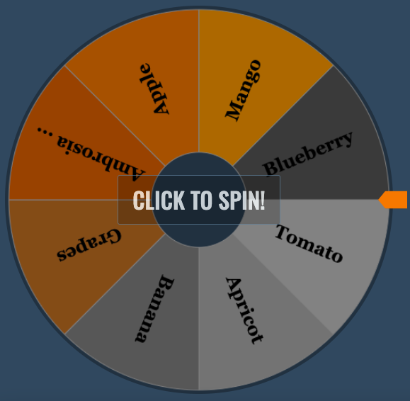

# 🎯 Spin The Wheel - Random Picker

一个现代化的在线转盘抽奖工具，支持自定义项目、权重设置、主题切换等丰富功能。



## ✨ 功能特性

### 🎲 核心功能
- **随机抽奖**: 支持公平的随机选择算法
- **权重设置**: 为不同项目设置不同的中奖概率
- **音效支持**: 转盘音效、获奖音效，增强用户体验
- **响应式设计**: 完美适配桌面端和移动端

### 🎨 自定义选项
- **多种主题**: 经典、柔和、鲜艳、大地色、海洋色主题
- **自定义颜色**: 为每个扇形设置独特颜色
- **字体设置**: 多种字体选择和大小调节
- **转盘时长**: 可调节的转盘旋转时间

### 📊 数据管理
- **本地存储**: 自动保存设置和项目列表
- **导入导出**: 支持文本文件导入导出
- **结果记录**: 保存抽奖历史结果
- **项目管理**: 随机打乱、字母排序、删除获奖者

### 🔧 高级功能
- **隐藏控制面板**: 专注模式，放大转盘显示
- **移动端优化**: 针对移动设备的特殊优化
- **PWA支持**: 可安装为手机应用
- **无障碍访问**: 支持键盘导航和屏幕阅读器

## 🚀 快速开始

### 方法一：在线使用
直接访问：[https://spinwheelonline.org](https://spinwheelonline.org)

### 方法二：本地运行
1. 克隆或下载项目
2. 双击 `index.html` 即可在浏览器中打开
3. 或者启动本地服务器：
   ```bash
   # 使用 Python
   python3 -m http.server 8000
   
   # 使用 Node.js
   npx http-server
   
   # 使用 PHP
   php -S localhost:8000
   ```

## 📖 使用指南

### 基本使用
1. **添加项目**: 在"Entries"标签页的文本框中，每行输入一个项目
2. **设置权重**: 使用格式 `项目名称 : 权重数字`，例如 `苹果 : 3`
3. **点击转盘**: 点击转盘或"SPIN"按钮开始抽奖
4. **查看结果**: 获奖者会以弹窗形式显示

### 高级设置
- **主题切换**: 在高级设置中选择不同的颜色主题
- **自定义颜色**: 为前10个项目设置专属颜色
- **音效控制**: 开启/关闭转盘和获奖音效
- **字体调节**: 更改转盘文字的字体和大小

### 数据管理
- **导出数据**: 将项目列表导出为文本文件
- **导入数据**: 从文本文件批量导入项目
- **查看历史**: 在"Results"标签页查看历史结果

## 🛠️ 技术栈

- **前端**: HTML5 + CSS3 + Vanilla JavaScript
- **图形**: Canvas 2D API
- **存储**: LocalStorage
- **音频**: Web Audio API
- **部署**: Vercel (支持静态站点托管)

## 📁 项目结构

```
spin-the-wheel/
├── index.html              # 主页面
├── user-guide.html         # 用户指南
├── about-us.html           # 关于我们
├── contact-us.html         # 联系我们
├── privacy-policy.html     # 隐私政策
├── terms-of-use.html       # 使用条款
├── static/
│   ├── css/
│   │   └── index.css       # 主样式文件
│   ├── js/
│   │   ├── pickerwheel.js  # 转盘核心逻辑
│   │   └── userguide.js    # 用户指南脚本
│   ├── img/               # 图片资源
│   └── music/             # 音效文件
├── robots.txt             # 搜索引擎抓取规则
├── sitemap.xml           # 网站地图
├── site.webmanifest      # PWA配置
└── README.md             # 项目文档
```

## 🚀 部署指南

### Vercel 部署（推荐）
1. 将代码推送到 GitHub
2. 在 Vercel 中导入项目
3. 自动部署完成

### 其他静态托管
- **Netlify**: 拖拽文件夹即可部署
- **GitHub Pages**: 启用 Pages 功能
- **Cloudflare Pages**: 连接 Git 仓库自动部署

## 🔒 安全特性

- **CSP安全策略**: 防止XSS攻击
- **安全的DOM操作**: 避免innerHTML注入
- **无外部依赖**: 降低供应链风险
- **本地数据存储**: 隐私保护

## 🌏 浏览器支持

- ✅ Chrome 60+
- ✅ Firefox 55+
- ✅ Safari 12+
- ✅ Edge 79+
- ✅ 移动端浏览器

## 🤝 贡献指南

欢迎提交 Issue 和 Pull Request！

1. Fork 项目
2. 创建功能分支 (`git checkout -b feature/AmazingFeature`)
3. 提交更改 (`git commit -m 'Add some AmazingFeature'`)
4. 推送到分支 (`git push origin feature/AmazingFeature`)
5. 创建 Pull Request

## 📄 许可证

本项目采用 MIT 许可证 - 查看 [LICENSE](LICENSE) 文件了解详情

## 📞 联系我们

- 网站：[https://spinwheelonline.org](https://spinwheelonline.org)
- 邮箱：contact@spinwheelonline.org
- 问题反馈：[GitHub Issues](https://github.com/yourusername/spin-the-wheel/issues)

---

⭐ 如果这个项目对你有帮助，请给它一个 Star！